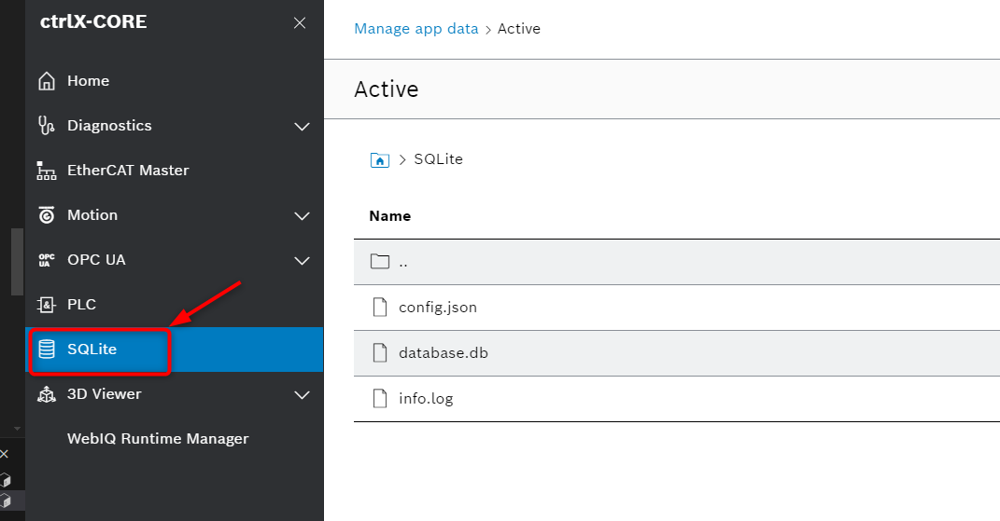
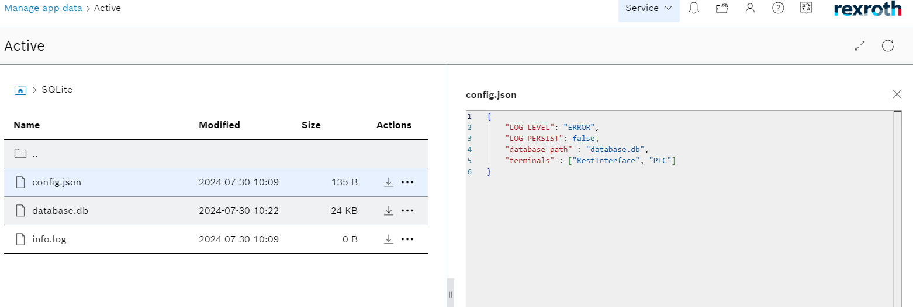

# README sqlite-ctrlx

This python app __sqlite-ctrlx__ provides datalayer nodes on a bosch rexroth ctrlX core for interaction with an SQLite database residing on the core.

## Usage

Enter SQL commmands into the terminals provided on the ctlrX core datalayer. Use a semicolon between commands to run multiple commands. The last command will return a result if requested and not followed by a semicolon (a semicolon will suppress responses from the database).


### Commands are given with an HTTP PUT request. The response contains the resulte of the query.

#### A put request with the following json creates a table called customer with name and age columns. The response is empty.

##### Request:
```json
  {
    "type": "string",
    "value": "create table customers (name varchar(255), age int)"
  }
```

##### Response:
```json
  {
    "type": "string",
    "value": "[]"
  }
```

#### Here, a series of commands are issued with a semi-colon between each command.
##### Request: 
```json
  {
    "type": "string",
    "value": "insert into customers VALUES ('Jim', '34'); insert into customers VALUES ('Mark', '42'); insert into customers VALUES ('Chris', '51');"
  }
 ``` 

##### Response:
```json
  {
    "type": "string",
    "value": "[]"
  }
```

#### Here, a set of data is pulled and the response shows the requested data.
##### Request: 
```json
 {
    "type": "string",
    "value": "select * from customers"
  }
```
##### Response:
```json
  {
    "type": "string",
    "value": "[('Jim', 34), ('Mark', 42), ('Chris', 51)]"
  }
```

#### Here, more specific data is pulled form the table. 

##### Request: 
```json
  {
    "type": "string",
    "value": "select name from customers where age > 40"
  }
```
##### Response:
```json
  {
    "type": "string",
    "value": "[('Mark',), ('Chris',)]"
  }
```

### The database flies along with a log and configuration file is stored in the app data of the ctrlX. 
  These files can be downloaded or archived through the ctrlX utilites. 




  The configuration file can be used to change the logging level of the log file (ERROR, WARNING, INFO, DEBUG), set the persistence of the log through power cycle, specify the database path relative to the config file, and configure the SQLite node names as they appear on the datalayer.



## License

MIT License

Permission is hereby granted, free of charge, to any person obtaining a copy
of this software and associated documentation files (the "Software"), to deal
in the Software without restriction, including without limitation the rights
to use, copy, modify, merge, publish, distribute, sublicense, and/or sell
copies of the Software, and to permit persons to whom the Software is
furnished to do so, subject to the following conditions:

The above copyright notice and this permission notice shall be included in all
copies or substantial portions of the Software.

THE SOFTWARE IS PROVIDED "AS IS", WITHOUT WARRANTY OF ANY KIND, EXPRESS OR
IMPLIED, INCLUDING BUT NOT LIMITED TO THE WARRANTIES OF MERCHANTABILITY,
FITNESS FOR A PARTICULAR PURPOSE AND NONINFRINGEMENT. IN NO EVENT SHALL THE
AUTHORS OR COPYRIGHT HOLDERS BE LIABLE FOR ANY CLAIM, DAMAGES OR OTHER
LIABILITY, WHETHER IN AN ACTION OF CONTRACT, TORT OR OTHERWISE, ARISING FROM,
OUT OF OR IN CONNECTION WITH THE SOFTWARE OR THE USE OR OTHER DEALINGS IN THE
SOFTWARE.
